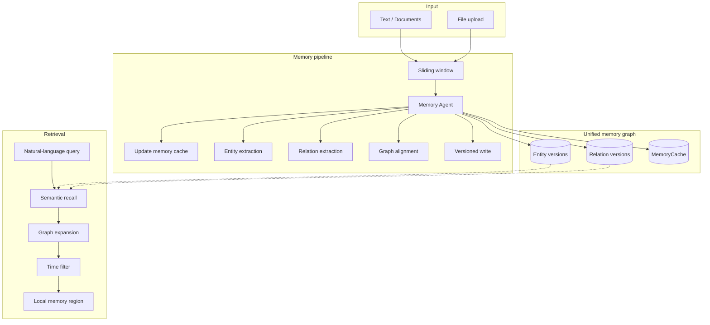

<p align="center">
  
  
  
  
</p>

<p align="center">
  <strong>Temporal Memory Graph (TMG)</strong>
</p>
<p align="center">
  <b>Long-term memory for AI agents</b> — store, recall, and traverse in time, the way humans do.
</p>

<p align="center">
  <a href="README.md">中文</a> · <a href="README.en.md">English</a> · <a href="README.ja.md">日本語</a>
</p>

---

## Overview

TMG gives AI agents **temporal, natural-language memory**: long-term storage and retrieval designed for agents, with human-like semantics (natural language in and out) and **time as a first-class citizen**—every memory is traceable, and entities and relations carry version chains. Experiences are written into a single unified graph; natural-language queries wake up relevant regions and support questions like “what happened then?”

| Focus | Description |
|-------|-------------|
| **Agent-oriented** | Built for agents: long-term memory read/write, not human-facing notes or knowledge bases. |
| **Human-like** | Natural language in, natural language out; no predefined tags; the system does concept extraction and relation building. |
| **Time as first-class** | Memories are timestamped; entities and relations have version chains and support time-range or point-in-time queries. |
| **Unified graph** | All memories live in one graph; semantic retrieval plus graph expansion returns “a region of related memory.” |

System boundary: TMG provides **Remember** (write) and **Find** (retrieve) only; **Select** (what to use, how to use it) is left to the caller.

### Compared to traditional knowledge graphs

| Aspect | Traditional KG | TMG |
|--------|----------------|-----|
| Relations | Fixed types (e.g. is_a, located_in) | Natural-language descriptions (concept edges) |
| Write | Structured input and schema | Raw text/documents; system extracts and aligns |
| Time | Static or simple timestamps | Version chains + timestamps; time-travel queries |
| Updates | Often overwrite | Append-only; full history kept |
| Retrieval | Structured queries, tag filters | Semantic search + graph neighborhood expansion |

---

## Architecture



---

## Quick start

```bash
cp service_config.example.json service_config.json
# Edit service_config.json: LLM and embedding
python -m server.api --config service_config.json
```

Open **http://localhost:16200/** in your browser to access the Web Dashboard. The dashboard shares port 16200 with the API — no extra process needed.

**Web Dashboard — 6 pages:**

| Page | Features |
|------|----------|
| **Dashboard** | System overview: uptime, graph count, entity/relation stats, API success rate, task queue, system logs (5s auto-refresh) |
| **Graph** | Interactive graph visualization (vis-network.js): force-directed layout, adjustable entity/relation limits, click nodes for detail & version history |
| **Memory** | Memory management: text input or drag-and-drop file upload, event time & source settings, task queue viewer, document list |
| **Search** | Semantic search: natural-language queries, similarity threshold, max results, time-range filter, graph expansion, multi-query batch mode |
| **Entities** | Entity browser: list all entities, semantic search, click for detail & version timeline (expandable content, name-change diffs) |
| **Relations** | Relation browser: list all relations, semantic search, query relations between two entities |

Tech stack: Pure HTML/CSS/JS (no build tools), Tailwind CSS + vis-network.js + Lucide Icons, SPA hash routing.

**Remember (POST JSON or multipart file upload; async, returns task_id):**

> `graph_id` is optional — defaults to `"default"` when omitted. Specify explicitly only when you need multi-graph isolation.

```bash
# JSON body
curl -s -X POST http://localhost:16200/api/v1/remember \
  -H "Content-Type: application/json" \
  -d '{"text":"Lin Heihei is an archaeology PhD who met a talking white fox in a cave.","event_time":"2026-03-09T14:00:00"}' | jq
# → {"success": true, "data": {"task_id": "abc123", "status": "queued", ...}}

# File upload
curl -s -X POST http://localhost:16200/api/v1/remember \
  -F "file=@document.txt" \
  -F "source_document=document.txt" | jq

# Check task status
curl -s "http://localhost:16200/api/v1/remember/tasks/abc123" | jq
```

Unfinished tasks are persisted under `storage_path/<graph_id>/tasks/` and re-queued after restart. Original text is saved as flat files `docs/{YYYYMMDD_HHMMSS}_{source_name}.txt`, sorted naturally by filename (i.e. chronologically). With `flask_threaded: true` (default), Find stays responsive while Remember runs.

**Find:**

```bash
curl -s -X POST http://localhost:16200/api/v1/find \
  -H "Content-Type: application/json" \
  -d '{"query": "What happened between Lin Heihei and the white fox?"}' | jq
```

---

## Using the Skill (agent integration)

TMG ships a **Skill** so that Cursor, Claude, and similar agents can deploy, configure, start, and call the API by following the documentation—no hand-written HTTP client.

### Where the Skill lives

- **Path:** `Temporal_Memory_Graph/skills/tmg-memory-graph/`
- **Files:** `SKILL.md` (agent instructions), `reference.md` (API quick reference)
- **Purpose:** Any agent that can “read docs and act” can use TMG after reading the Skill (when to use, how to deploy, how to call the API).

### Three steps to give an agent access

1. **Expose the Skill to the agent**  
   - **Cursor:** In rules, add “When using TMG memory, read and follow `Temporal_Memory_Graph/skills/tmg-memory-graph/SKILL.md`,” or copy key points into `.cursor/rules`.  
   - **Claude / others:** Add `skills/tmg-memory-graph/` to the agent’s skill directory or knowledge base.

2. **Trigger with natural language**  
   When the user says “remember this,” “look up what we knew about X,” or “connect to TMG memory,” the agent reads the Skill and runs the flow (check service → remember/find).

3. **What the agent will do**  
   - If the service is not running: clone repo → configure `service_config.json` → run `python -m server.api` → verify with `GET /api/v1/health`.
   - Remember: `POST /api/v1/remember` with JSON field `text` (or multipart `file` upload), optional `graph_id` (defaults to `"default"`), optional `source_document`/`source_name`/`event_time`/`load_cache_memory`.
   - Find: `POST /api/v1/find` with natural-language `query` (`graph_id` optional, defaults to `"default"`); use entity/relation/version atomic endpoints when needed.

---

## API summary

### Remember — write (POST)

POST JSON body (multipart file upload is also accepted); `text` or `file` is required. Batch substantial content — avoid one-sentence calls.

| Param | Required | Description |
|-------|----------|-------------|
| `graph_id` | No | Target graph ID (defaults to `"default"`) |
| `text` | One of `text` / `file` | Natural-language text (JSON body) |
| `file` | One of `text` / `file` | Uploaded file (multipart) |
| `source_document` | No | Source document name (backward-compat: `doc_name`) |
| `source_name` | No | Source label |
| `event_time` | No | ISO 8601 — when events actually happened |
| `load_cache_memory` | No | `true`/`false` |

The service saves the full text to `storage_path/<graph_id>/docs/{YYYYMMDD_HHMMSS}_{source_name}.txt` (flat files sorted naturally by filename, i.e. chronologically) and journals task state under `<graph_id>/tasks/`. After a crash, queued/running tasks are re-queued. Internally: chunking, memory cache update, entity/relation extraction, graph alignment, versioned write.

### Find — retrieve

All Find endpoints accept an optional `graph_id` (query string, JSON body, or form field) — defaults to `"default"` when omitted.

- **Recommended:** `POST /api/v1/find` — semantic recall, graph expansion, and time filtering in one call; required: `query`; rest optional.
- **Atomic endpoints:** Entity search (`/api/v1/find/entities/search`, etc.), relations, memory cache, stats (`/api/v1/find/stats`), batch fetch (`POST /api/v1/find/candidates`).

Full paths and parameters: see `skills/tmg-memory-graph/reference.md` and `server/api.py`.

### Response format

- Success: `{"success": true, "data": ..., "elapsed_ms": 123.45}`
- Error: `{"success": false, "error": "message", "elapsed_ms": 12.34}`

---

## Data model (brief)

- **Entity:** Concept entity; `entity_id` (logical), `id` (version absolute ID), `name`, `content` (natural language), `event_time`, `processed_time`; versions form a chain.
- **Relation:** Concept relation; natural-language description (no fixed relation types); `entity1/2_absolute_id`, `event_time`, `processed_time`, version chain.  
- **MemoryCache:** Internal context summary chain for alignment and reasoning.  

All content is natural language + time; no predefined tag schema.

---

## Configuration

See `service_config.example.json`; configure `service_config.json` with:

- **Service:** `host`, `port`, `storage_path`  
- **Concurrency:** `flask_threaded` (default `true` — Find while Remember runs)  
- **LLM:** `api_key`, `model`, `base_url`, `think`  
- **Embedding:** `embedding.model` (local path or HuggingFace id), `embedding.device`  
- **Chunking:** `chunking.window_size`, `chunking.overlap`  

For Ollama, set `llm.base_url` to `http://127.0.0.1:11434` and use the native `POST /api/chat` endpoint. Only the native Ollama protocol supports `think: true/false`; do not use the `/v1` OpenAI-compatible URL when you need to disable thinking.

---

## License

See the [LICENSE](LICENSE) file in the repository root, if present.
