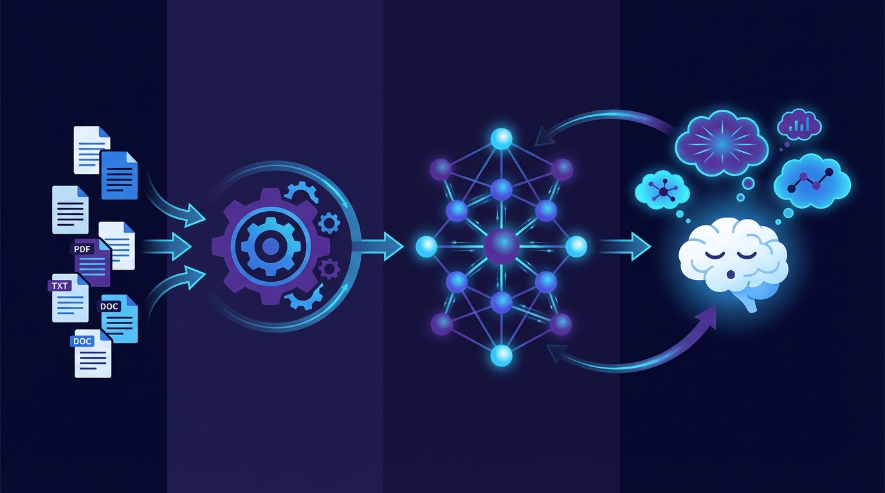

<p align="center">
  
  
  
  
</p>

<p align="center">
  <strong>Deep Dream</strong>
</p>
<p align="center">
  <b>Full-lifecycle memory for AI agents</b> — remember, recall, and dream like a human.
</p>

<p align="center">
  
</p>

<p align="center">
  <a href="README.md">中文</a> · <a href="README.en.md">English</a> · <a href="README.ja.md">日本語</a>
</p>

---

## Humans spend one-third of their lives asleep

This is not wasted time. During sleep, the brain is far from idle — it **replays** the day's experiences, **reorganizes** memory fragments, and **discovers** hidden connections that waking consciousness never had time to notice. Every REM cycle is an act of autonomous knowledge consolidation: weaving scattered fragments into networks, crystallizing vague intuitions into insight.

**Deep Dream gives AI agents the same ability.**

Deep Dream is a long-term memory system for agents. While awake, agents write memories (Remember) and retrieve them (Find). When an agent enters "sleep," **DeepDream autonomous dream consolidation** begins — a Dream Agent endlessly traverses the knowledge graph, discovering hidden relations between entities and building new conceptual bridges, just like the brain's free association during the night.

---

## Why do agents need to dream?

| Human Memory | Deep Dream |
|-------------|-----------|
| Daily experience → encode memory | Text/documents → **Remember** into knowledge graph |
| Recall the past → retrieve memory | Natural-language query → **Find** via semantic search |
| Nightly sleep → consolidate & reorganize | Dream Agent → **DeepDream** discovers new relations |

Traditional knowledge graphs are **static** — what you write is what you get. Human memory doesn't work that way. In dreams, we reconnect fragments and discover patterns invisible to waking thought. DeepDream gives agents the same capability:

- **Beyond nearest neighbors** — Not just similar entities; discovers connections across vast semantic distances
- **Associative leaps** — Like free association in dreams, jumping from one concept to a seemingly unrelated one
- **Multi-strategy dreaming** — Free association, contrastive analysis, temporal bridging, cross-domain discovery, orphan adoption, hub remix... strategies rotate cyclically
- **Never stops** — As long as the agent is "asleep," dreaming continues in infinite iterations

### Key constraint

The Dream Agent follows one strict rule: **it can only discover new relations between existing entities — never fabricate entities that don't exist.** Just as humans recombine existing memories in dreams rather than inventing entirely new people and events. All dream discoveries carry clear provenance markers (`source: dream`), cleanly separated from waking memories.

---

## Core Architecture

Deep Dream provides three layers of capability:

<p align="center">
  
</p>

```
Remember (awake)            Find (when needed)        Dream (asleep)
┌──────────────┐      ┌──────────────┐      ┌────────────────────┐
│ Text → Entity │      │ Semantic      │      │ Dream Agent        │
│ Docs → Rel.   │      │ Graph expand  │      │  ├─ Strategy select│
│ Versioned     │      │ Time travel   │      │  ├─ Tool calls     │
│ write         │      │               │      │  ├─ Relation find  │
└──────┬───────┘      └──────┬───────┘      │  └─ Infinite loop  │
       │                     │              └────────┬───────────┘
       ▼                     ▼                       ▼
   ┌───────────────────────────────────────────────────────┐
   │              Unified Memory Knowledge Graph            │
   │       Entity versions · Relation versions · Episode    │
   └───────────────────────────────────────────────────────┘
```

The Dream Agent is not a hardcoded loop — it is an **autonomous agent** that connects to Deep Dream's API through a skill, autonomously deciding:
- Which dream strategy to use at each step
- Which entities and relations to traverse
- When to propose new relation hypotheses
- When to record dream discoveries

---

## Quick Start

```bash
git clone https://github.com/ngyygm/deep-dream.git
cd deep-dream
pip install -r requirements.txt
cp service_config.example.json service_config.json
# Edit service_config.json: configure LLM and Embedding
python -m server.api --config service_config.json
```

Open **http://127.0.0.1:16200/** in your browser for the management dashboard.

### Write memory

```bash
curl -s -X POST http://localhost:16200/api/v1/remember \
  -H "Content-Type: application/json" \
  -d '{"text":"Lin Heihei is an archaeology PhD who met a talking white fox in a cave. The fox said it has guarded the cave for 300 years.","event_time":"2026-03-09T14:00:00"}'
```

### Retrieve memory

```bash
curl -s -X POST http://localhost:16200/api/v1/find \
  -H "Content-Type: application/json" \
  -d '{"query": "What happened between Lin Heihei and the white fox?"}'
```

### Start dream consolidation

```bash
curl -s -X POST http://localhost:16200/api/v1/find/dream/agent/start \
  -H "Content-Type: application/json" \
  -d '{"max_cycles": 10, "strategies": ["free_association", "cross_domain", "leap"]}'
```

---

## Dream Strategies

| Strategy | Analogy | Goal |
|----------|---------|------|
| `free_association` | Free association | Find hidden connections between random entities |
| `contrastive` | Contrastive analysis | Discover differences between similar entities |
| `temporal_bridge` | Time travel | Find evolution patterns across time |
| `cross_domain` | Cross-domain insight | Unexpected bridges between different fields |
| `orphan_adoption` | Orphan rescue | Find connections for isolated entities |
| `hub_remix` | Hub recombination | New paths between core nodes |
| `leap` | Creative leap | Far-distance associative jumps |
| `narrative` | Story weaving | Weave scattered fragments into narrative threads |

---

## Configuration

See `service_config.example.json`:

| Config | Description |
|--------|-------------|
| `host` / `port` | Service address, default `0.0.0.0:16200` |
| `llm` | LLM config (Ollama / OpenAI-compatible / GLM etc.) |
| `embedding` | Embedding model (local path or HuggingFace name) |
| `chunking` | Sliding window size and overlap |
| `runtime.concurrency.*` | Three-tier concurrency control |

---

## Agent Integration

Deep Dream ships a Skill so any agent that supports skill invocation (Cursor, Claude Code, etc.) can directly use memory and dream capabilities:

- **Skill name:** `deep-dream` (created via skill-creator)
- **Path:** `.claude/skills/deep-dream/`
- **Integration:** Add the Skill to the agent's skill directory, and the agent can autonomously Remember, Find, and Dream.

---

## License

See [LICENSE](LICENSE) in the repository root.
