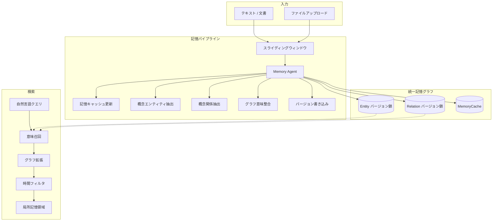

<p align="center">
  
  
  
  
</p>

<p align="center">
  <strong>Temporal Memory Graph (TMG)</strong>
</p>
<p align="center">
  <b>Agent 向け長期記憶</b> —— 人間のように記憶し、想起し、時間を遡る。
</p>

<p align="center">
  <a href="README.md">中文</a> · <a href="README.en.md">English</a> · <a href="README.ja.md">日本語</a>
</p>

---

## 概要

TMG は AI Agent に**時間付きの自然言語記憶**を提供します。Agent 向けの**長期記憶の格納・検索**、**人間と同様の**自然言語による記憶・想起、そして**時間を第一級**として扱い、各記憶は追跡可能、エンティティ・関係はバージョン鎖を持ちます。経験は単一の統一グラフに書き込まれ、自然言語の質問で関連領域を喚起し、「あのとき何があったか」のような時間遡行をサポートします。

| 方針 | 説明 |
|------|------|
| **Agent 向け** | エージェント用の長期記憶の読み書きであり、人間向けメモやナレッジベースではない。 |
| **人間のように** | 自然言語で書き、自然言語で検索。事前定義タグに依存せず、システムが概念抽出・関係構築を行う。 |
| **時間は第一級** | 記憶にタイムスタンプ、エンティティ・関係にバージョン鎖。時間範囲・時点での遡行が可能。 |
| **統一グラフ** | 全記憶を一つのグラフに格納。意味検索＋グラフ拡張で「関連記憶の領域」を返す。 |

システムの責務：**Remember**（書き込み）と **Find**（検索）のみ。**Select**（何をどう使うか）は呼び出し側が担当。

### 従来の知識グラフとの比較

| 観点 | 従来の KG | TMG |
|------|-----------|-----|
| 関係 | 固定タイプ（is_a, located_in 等） | 自然言語記述（概念辺） |
| 書き込み | 構造化入力とスキーマが必要 | テキスト/文書をそのまま投入、システムが抽出・整合 |
| 時間 | 静的または単純なタイムスタンプ | バージョン鎖＋タイムスタンプ、時間遡行クエリ対応 |
| 更新 | 上書きが多い | 追記型、履歴を保持 |
| 検索 | 構造化クエリ・タグフィルタ | 意味検索＋グラフ近傍拡張 |

---

## アーキテクチャ



---

## クイックスタート

```bash
cp service_config.example.json service_config.json
# service_config.json を編集：LLM と embedding
python -m server.api --config service_config.json
```

ブラウザで **http://localhost:16200/** を開くと Web ダッシュボードが表示されます。ダッシュボードは API と同じ 16200 ポートを共有するため、追加プロセスは不要です。

**Web ダッシュボード — 6 ページ：**

| ページ | 機能 |
|--------|------|
| **Dashboard** | システム概要：稼働時間、グラフ数、エンティティ/関係の統計、API 成功率、タスクキュー、システムログ（5秒自動更新） |
| **Graph** | インタラクティブグラフ可視化（vis-network.js）：力指向レイアウト、エンティティ/関係数の調整、ノードクリックで詳細とバージョン履歴 |
| **Memory** | 記憶管理：テキスト入力またはドラッグ＆ドロップファイルアップロード、イベント時刻とソース設定、タスクキュービューア、ドキュメント一覧 |
| **Search** | 意味検索：自然言語クエリ、類似度閾値、最大結果数、時間範囲フィルタ、グラフ拡張、マルチクエリバッチモード |
| **Entities** | エンティティブラウザ：全エンティティ一覧、意味検索、クリックで詳細とバージョンタイムライン（展開可能、名前変更差分表示） |
| **Relations** | 関係ブラウザ：全関係一覧、意味検索、2つのエンティティ間の関係クエリ |

技術スタック：Pure HTML/CSS/JS（ビルドツール不要）、Tailwind CSS + vis-network.js + Lucide Icons、SPA ハッシュルーティング。

**記憶の書き込み（POST JSON または multipart ファイルアップロード；非同期で task_id を返す）：**

> `graph_id` は省略可能。省略時は `"default"` が使用されます。マルチグラフ分離が必要な場合のみ明示的に指定してください。

```bash
# JSON ボディ
curl -s -X POST http://localhost:16200/api/v1/remember \
  -H "Content-Type: application/json" \
  -d '{"text":"林嘿嘿は考古学博士で、洞窟で話す白狐に出会った。白狐は三百年この洞窟を守ってきたと言った。","event_time":"2026-03-09T14:00:00"}' | jq

# ファイルアップロード
curl -s -X POST http://localhost:16200/api/v1/remember \
  -F "file=@document.txt" \
  -F "source_document=document.txt" | jq

# タスク状態確認
curl -s "http://localhost:16200/api/v1/remember/tasks/abc123" | jq
```

未完了タスクは `<graph_id>/tasks/` に保存され、再起動後に再入隊されます。原文は `docs/{YYYYMMDD_HHMMSS}_{source_name}.txt` のフラットファイルとして保存され、ファイル名順（＝時系列順）に並びます。`flask_threaded: true`（既定）なら Remember 処理中も Find を並行処理できます。

**記憶の検索：**

```bash
curl -s -X POST http://localhost:16200/api/v1/find \
  -H "Content-Type: application/json" \
  -d '{"query": "林嘿嘿と白狐のあいだに何があったか"}' | jq
```

---

## Skill の利用（Agent 連携）

TMG は **Skill** を同梱しており、Cursor や Claude などの Agent がドキュメントに従ってデプロイ・設定・起動・API 呼び出しを行えます（HTTP クライアントの手書き不要）。

### Skill の場所と内容

- **パス:** `Temporal_Memory_Graph/skills/tmg-memory-graph/`
- **ファイル:** `SKILL.md`（Agent 向け手順）、`reference.md`（API クイックリファレンス）
- **役割:** 「ドキュメントを読んで実行」できる Agent が SKILL を読むことで、TMG をいつ使うか・どうデプロイするか・どう API を呼ぶかを実行可能にする。

### Agent に TMG を使わせる 3 ステップ

1. **Skill を Agent に渡す**  
   - **Cursor:** ルールに「TMG 記憶を使うときは `Temporal_Memory_Graph/skills/tmg-memory-graph/SKILL.md` を読み従う」と追記するか、要点を `.cursor/rules` に書く。  
   - **Claude / その他:** `skills/tmg-memory-graph/` をその Agent のスキルディレクトリやナレッジベースに追加する。

2. **自然言語でトリガー**  
   「これを覚えておいて」「〇〇について以前覚えたことを検索して」「TMG 記憶サービスに接続して」などとユーザーが言ったときに、Agent が SKILL を読み、フロー（サービス確認 → remember/find）を実行する。

3. **Agent が行うこと**  
   - サービスが未起動なら: リポジトリ clone → `service_config.json` 設定 → `python -m server.api` 起動 → `GET /api/v1/health` で確認。
   - 記憶: `POST /api/v1/remember` に JSON フィールド `text`（または multipart `file` アップロード）、オプション `graph_id`（既定 `"default"`）、オプション `source_document`/`source_name`/`event_time`/`load_cache_memory`。
   - 検索: `POST /api/v1/find` に自然言語の `query`（`graph_id` はオプション、既定 `"default"`）。必要に応じてエンティティ/関係/バージョンの原子 API を使用。

---

## API 概要

### Remember — 書き込み（POST）

POST JSON 本文（multipart ファイルアップロードも可）。`text` と `file` のどちらかが必須。まとまった内容をバッチで送信し、一文ずつの呼び出しは避けてください。

| パラメータ | 必須 | 説明 |
|------------|------|------|
| `graph_id` | いいえ | 対象グラフ ID（既定 `"default"`） |
| `text` | `text` か `file` のどちらか | 自然言語テキスト（JSON ボディ） |
| `file` | `text` か `file` のどちらか | アップロードファイル（multipart） |
| `source_document` | いいえ | ソースドキュメント名（旧 `doc_name` 互換） |
| `source_name` | いいえ | ソースラベル |
| `event_time` | いいえ | ISO 8601 |
| `load_cache_memory` | いいえ | `true`/`false` |

全文を `storage_path/<graph_id>/docs/{YYYYMMDD_HHMMSS}_{source_name}.txt` にフラットファイルとして保存し（ファイル名順＝時系列順）、タスク状態を `<graph_id>/tasks/` に記録します。異常終了後の再起動で未完了タスクを再入隊します。

### Find — 検索

すべての検索エンドポイントで `graph_id` は省略可能です（query string、JSON ボディ、または form フィールド）。省略時は `"default"` が使用されます。

- **推奨:** `POST /api/v1/find` — 意味召回・グラフ拡張・時間フィルタを 1 リクエストで実行。必須は `query`、他は任意。
- **原子 API:** エンティティ検索（`/api/v1/find/entities/search` 等）、関係、記憶キャッシュ、統計（`/api/v1/find/stats`）、条件に基づく一括取得（`POST /api/v1/find/candidates`）。

完全なパスとパラメータは `skills/tmg-memory-graph/reference.md` および `server/api.py` を参照。

### レスポンス形式

- 成功: `{"success": true, "data": ..., "elapsed_ms": 123.45}`
- 失敗: `{"success": false, "error": "メッセージ", "elapsed_ms": 12.34}`

---

## データモデル（概要）

- **Entity:** 概念エンティティ。`entity_id`（論理 ID）、`id`（バージョン絶対 ID）、`name`、`content`（自然言語）、`event_time`、`processed_time`。複数バージョンで鎖を形成。
- **Relation:** 概念関係。自然言語記述（固定関係タイプではない）。`entity1/2_absolute_id`、`event_time`、`processed_time`、バージョン鎖。  
- **MemoryCache:** システム内部のコンテキスト要約鎖。整合・推論に使用。  

内容はすべて自然言語＋時間。事前定義タグ体系はなし。

---

## 設定

`service_config.example.json` を参照し、`service_config.json` で以下を設定：

- **サービス:** `host`, `port`, `storage_path`  
- **並行:** `flask_threaded`（既定 `true` — Remember 中も Find 可）  
- **LLM:** `api_key`, `model`, `base_url`, `think`  
- **Embedding:** `embedding.model`（ローカルパスまたは HuggingFace 名）、`embedding.device`  
- **チャンク:** `chunking.window_size`, `chunking.overlap`  

Ollama を使う場合、`llm.base_url` は `http://127.0.0.1:11434` に設定し、ネイティブの `POST /api/chat` を使用します。`think: true/false` で思考モードを制御できるのは Ollama のネイティブプロトコルだけなので、無効化したい場合は `/v1` の OpenAI 互換 URL を使わないでください。

---

## License

リポジトリルートの [LICENSE](LICENSE) を参照（存在する場合）。
