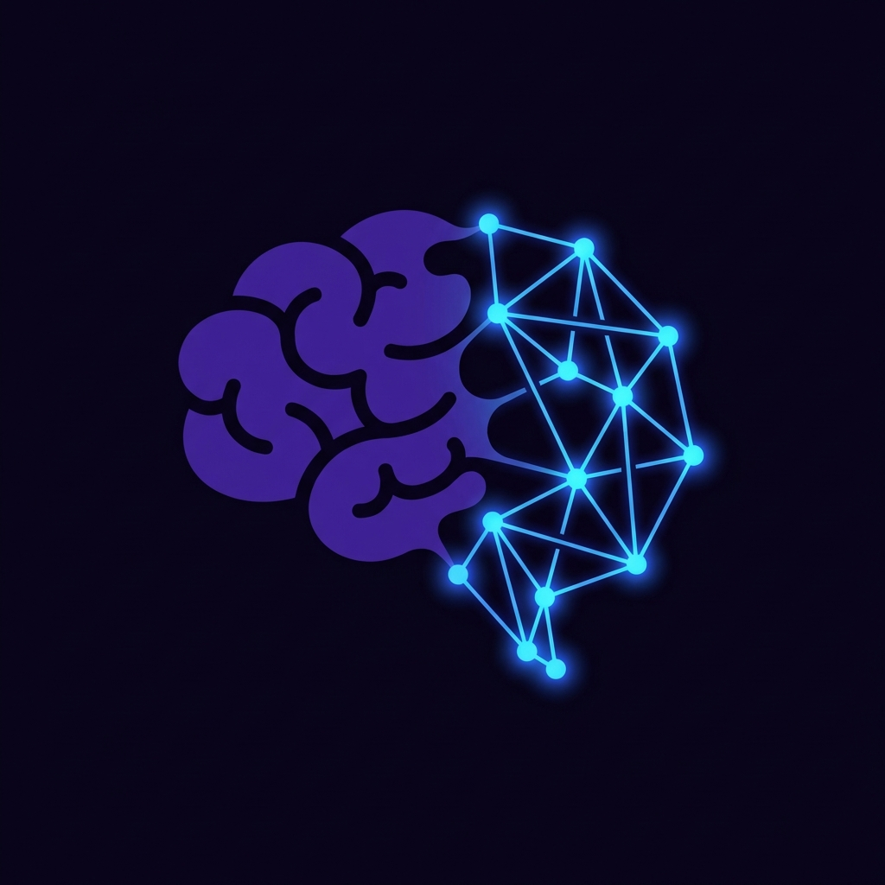

<p align="center">
  
  
  
  
</p>

<p align="center">
  <strong>Deep Dream</strong>
</p>
<p align="center">
  <b>Agent の全ライフサイクル記憶</b> — 人間のように記憶し、回溯し、夢を見る。
</p>

<p align="center">
  
</p>

<p align="center">
  <a href="README.md">中文</a> · <a href="README.en.md">English</a> · <a href="README.ja.md">日本語</a>
</p>

---

## 人は人生の三分の一を睡眠に費やす

これは決して無駄ではない。睡眠中、脳は休んでいるのではない——昼間の経験を**再生**し、記憶の断片を**再構成**し、覚醒時には気づかなかった隠れたつながりを**発見**している。レム睡眠のたびに、散らばった断片がネットワークに編まれ、曖昧な直感が洞察として結晶化する。

**Deep Dream は AI Agent に同じ能力を与える。**

Deep Dream は Agent 向けの長期記憶システム。覚醒時は記憶を書き込み（Remember）、必要時に検索する（Find）。そして Agent が「睡眠」状態に入ると、**DeepDream 自律的夢境統合**が起動——Dream Agent が無限に知識グラフを巡回し、実体間の隠れた関係を発見し、新しい概念の架け橋を構築する。

---

## なぜ Agent は夢を見る必要があるのか？

| 人間の記憶 | Deep Dream |
|----------|-----------|
| 日中の経験 → 記憶の書き込み | テキスト/文書 → **Remember** で知識グラフに書き込み |
| 過去を思い出す → 記憶の検索 | 自然言語での質問 → **Find** で意味検索 |
| 夜の睡眠 → 記憶の統合・再構成 | Dream Agent → **DeepDream** で新関係を自律発見 |

従来の知識グラフは**静的**——書いたものがそのまま。人間の記憶はそうではない。夢の中で記憶の断片を再接続し、覚醒時には見えないパターンを発見する。DeepDream は Agent に同じ能力を与える：

- **最近接に限らない** — 類似実体間だけでなく、意味的距離の遠い接続も発見
- **跳躍的思考** — 夢の中の自由連想のように、無関係に見える概念間を跳躍
- **マルチ戦略** — 自由連想、対比分析、時間ブリッジ、クロスドメイン…戦略を循環
- **永遠に続く** — Agent が「睡眠」中、夢は無限の反復で持続

### 重要な制約

Dream Agent は一つの厳格なルールに従う：**既存の実体間の新関係のみ発見し、存在しない実体を捏造しない。** 人間が夢の中で既存の記憶を再編成するのと同じ。すべての夢の発見には明確な出典マーク（`source: dream`）が付与され、覚醒時の記憶と明確に区別される。

---

## コアアーキテクチャ

```
Remember（覚醒時）         Find（必要時）          Dream（睡眠時）
┌──────────────┐     ┌──────────────┐     ┌────────────────────┐
│ テキスト→実体 │     │ 意味検索      │     │ Dream Agent        │
│ 文書→関係    │     │ グラフ拡張    │     │  ├─ 戦略選択        │
│ バージョン化 │     │ 時間遡行      │     │  ├─ ツール呼び出し   │
│ 書き込み     │     │              │     │  ├─ 関係発見        │
└──────┬───────┘     └──────┬───────┘     │  └─ 無限反復        │
       │                    │              └────────┬───────────┘
       ▼                    ▼                       ▼
   ┌──────────────────────────────────────────────────────┐
   │              統一記憶知識グラフ                         │
   │     Entity バージョン鎖 · Relation バージョン鎖 · Episode│
   └──────────────────────────────────────────────────────┘
```

Dream Agent はハードコードされたループではなく、**自律的エージェント** — スキルを通じて Deep Dream の API に接続し、自律的に判断する。

---

## クイックスタート

```bash
git clone https://github.com/ngyygm/deep-dream.git
cd deep-dream
pip install -r requirements.txt
cp service_config.example.json service_config.json
python -m server.api --config service_config.json
```

ブラウザで **http://127.0.0.1:16200/** を開く。

### 記憶の書き込み

```bash
curl -s -X POST http://localhost:16200/api/v1/remember \
  -H "Content-Type: application/json" \
  -d '{"text":"林嘿嘿は考古学博士で、洞窟で話す白狐に出会った。","event_time":"2026-03-09T14:00:00"}'
```

### 記憶の検索

```bash
curl -s -X POST http://localhost:16200/api/v1/find \
  -H "Content-Type: application/json" \
  -d '{"query": "林嘿嘿と白狐のあいだに何があったか"}'
```

### 夢境統合の開始

```bash
curl -s -X POST http://localhost:16200/api/v1/find/dream/agent/start \
  -H "Content-Type: application/json" \
  -d '{"max_cycles": 10, "strategies": ["free_association", "cross_domain", "leap"]}'
```

---

## 夢戦略

| 戦略 | アナロジー | 目標 |
|------|-----------|------|
| `free_association` | 自由連想 | ランダム実体間の隠れた接続 |
| `contrastive` | 対比分析 | 類似実体間の差異 |
| `temporal_bridge` | タイムトラベル | 時間を超えた進化パターン |
| `cross_domain` | 異分野インスピレーション | 異分野の意外な架け橋 |
| `orphan_adoption` | 孤立救済 | 孤立実体のつながり発見 |
| `hub_remix` | ハブ再結合 | 中核ノード間の新パス |
| `leap` | 創造的跳躍 | 遠距離の連想ジャンプ |
| `narrative` | 物語紡ぎ | 断片を物語に紡ぐ |

---

## 設定

`service_config.example.json` を参照。

---

## License

[LICENSE](LICENSE) を参照。
