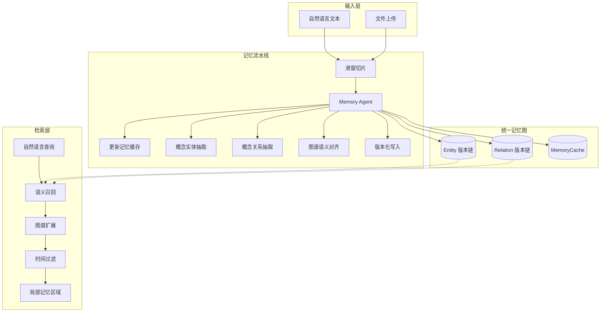

<p align="center">
  
  
  
  
</p>

<p align="center">
  <strong>Temporal Memory Graph (TMG)</strong>
</p>
<p align="center">
  为 Agent 设计的长期记忆系统 —— 像人类一样存、取、回溯。
</p>

<p align="center">
  <a href="README.md">中文</a> · <a href="README.en.md">English</a> · <a href="README.ja.md">日本語</a>
</p>

---

## 简介

TMG 让 AI Agent 拥有**带时间的自然语言记忆**。所有记忆写入一张统一知识图，用自然语言提问即可唤醒相关片段，并支持「那时发生了什么」式的时间回溯。

核心能力：**Remember**（写入记忆）+ **Find**（检索记忆）。**Select**（筛选与决策）由调用方完成。

| 特性 | 说明 |
|------|------|
| 面向 Agent | 为智能体提供长期记忆存储与检索，而非面向人类的笔记系统 |
| 自然语言 | 直接输入文本，系统自动完成概念抽取与关系构建，无需标签 |
| 时间是一等公民 | 每条记忆带时间戳，实体/关系具备版本链，支持按时间回溯 |
| 统一记忆图 | 所有记忆写入同一张图，语义检索 + 图谱扩展召回相关记忆 |

---

## 快速开始

### 1. 获取项目

```bash
git clone https://github.com/ngyygm/Temporal_Memory_Graph.git
cd Temporal_Memory_Graph
pip install -r requirements.txt
```

### 2. 配置服务

```bash
cp service_config.example.json service_config.json
```

打开 `service_config.json`，配置以下两项：

**LLM（必改）** — 选一种：

```jsonc
// 方案 A：本地 Ollama
"llm": { "api_key": "ollama", "model": "qwen2.5:7b", "base_url": "http://127.0.0.1:11434", "think": false }

// 方案 B：远程 OpenAI 兼容 API（智谱 / DeepSeek / 硅基流动等）
"llm": { "api_key": "你的 API Key", "model": "glm-4-flash", "base_url": "https://open.bigmodel.cn/api/paas/v4", "think": false }
```

**Embedding（必改）**：

```jsonc
// 填本地路径（已下载）或 HuggingFace 名称（首次自动下载）
"embedding": { "model": "Qwen/Qwen3-Embedding-0.6B", "device": "cpu" }
```

### 3. 启动服务

```bash
python -m server.api --config service_config.json

# 监控模式（推荐）：固定面板实时刷新状态
python -m server.api --config service_config.json --log-mode monitor
```

看到 `TMG 服务已启动` 和 `LLM 握手成功` 即表示启动成功。

### 4. 验证服务

```bash
curl -s "http://127.0.0.1:16200/api/v1/health" | python -m json.tool
```

### 5. 打开 Web 管理面板

服务启动后，浏览器访问 **http://127.0.0.1:16200/** 即可打开 Web 管理面板。Web 面板与 API 服务共用 16200 端口，无需额外进程。

**面板包含 6 个功能页面：**

| 页面 | 功能 |
|------|------|
| **Dashboard** | 系统概览：运行时间、图谱数量、实体/关系统计、API 成功率、任务队列、系统日志（5 秒自动刷新） |
| **Graph** | 交互式图谱可视化：vis-network.js 力导向图，可调实体/关系数量上限，点击节点查看详情与版本历史 |
| **Memory** | 记忆管理：文本直接输入或拖拽上传文件，设置事件时间与来源，查看任务处理队列与文档列表 |
| **Search** | 语义检索：自然语言查询，支持相似度阈值、最大结果数、时间范围过滤、图谱扩展，多条批量检索模式 |
| **Entities** | 实体浏览器：全部实体列表、语义搜索、点击查看详情与版本时间线（支持展开内容、名称变更对比） |
| **Relations** | 关系浏览器：全部关系列表、语义搜索、指定两实体查询关系 |

**技术栈：** 纯 HTML/CSS/JS（无构建工具），Tailwind CSS + vis-network.js + Lucide Icons，SPA 哈希路由。

### 6. 写入记忆

```bash
# JSON 方式
curl -s -X POST http://localhost:16200/api/v1/remember \
  -H "Content-Type: application/json" \
  -d '{"text":"林嘿嘿是考古学博士，在山洞遇见了会说话的白狐。白狐说已守护山洞三百年。","event_time":"2026-03-09T14:00:00"}' | jq

# 文件上传方式
curl -s -X POST http://localhost:16200/api/v1/remember \
  -F "file=@document.txt" \
  -F "source_document=document.txt" | jq
```

Remember 是异步处理，提交后立即返回 `task_id`。查看处理进度：

```bash
# 查看任务状态（queued → running → completed/failed）
curl -s "http://localhost:16200/api/v1/remember/tasks/<task_id>" | jq

# 查看任务队列
curl -s "http://localhost:16200/api/v1/remember/tasks?limit=10" | jq
```

> 进程异常退出后重启会自动恢复未完成的任务。

### 7. 检索记忆

```bash
curl -s -X POST http://localhost:16200/api/v1/find \
  -H "Content-Type: application/json" \
  -d '{"query": "林嘿嘿和白狐之间发生了什么"}' | jq
```

### 8. 多图谱隔离

通过 `graph_id` 参数创建独立的记忆库（默认 `"default"`）：

```bash
# 写入不同图谱
curl -s -X POST http://localhost:16200/api/v1/remember \
  -H "Content-Type: application/json" \
  -d '{"graph_id":"work","text":"今天完成了项目原型设计。","event_time":"2026-03-27T09:00:00"}'

# 检索指定图谱
curl -s -X POST http://localhost:16200/api/v1/find \
  -H "Content-Type: application/json" \
  -d '{"graph_id":"work","query":"最近做了什么"}'
```

### Python 示例

```python
import requests, time

BASE = "http://127.0.0.1:16200"

# 写入
r = requests.post(f"{BASE}/api/v1/remember", json={
    "text": "TMG 是一个为 AI Agent 设计的长期记忆系统。",
    "event_time": "2026-03-27T10:00:00",
})
task_id = r.json()["data"]["task_id"]

# 等待完成
while True:
    status = requests.get(f"{BASE}/api/v1/remember/tasks/{task_id}").json()["data"]["status"]
    if status in ("completed", "failed"):
        break
    time.sleep(2)

# 检索
r = requests.post(f"{BASE}/api/v1/find", json={"query": "TMG 是什么", "expand": True})
for e in r.json()["data"]["entities"]:
    print(f"  - {e['name']}: {e['content'][:60]}")
```

---

## 系统架构



---

## API 概览

### Remember — 记忆写入（POST，异步）

| 参数 | 必填 | 说明 |
|------|------|------|
| `graph_id` | 否 | 目标图谱 ID（默认 `"default"`） |
| `text` | 与 `file` 二选一 | 自然语言正文 |
| `file` | 与 `text` 二选一 | 上传文件（multipart） |
| `source_document` | 否 | 来源文档名称 |
| `event_time` | 否 | ISO 8601 事件时间 |
| `load_cache_memory` | 否 | `true`/`false` |

请求立即返回 `task_id`（HTTP 202），后台线程处理。

### Find — 语义检索

- **推荐**：`POST /api/v1/find`，传入 `query` 即可完成语义召回、图谱扩展与时间过滤
- **原子接口**：实体检索（`/api/v1/find/entities/search`）、关系检索、记忆缓存、统计（`/api/v1/find/stats`）等

### 响应格式

- 成功：`{"success": true, "data": ..., "elapsed_ms": 123.45}`
- 失败：`{"success": false, "error": "错误信息", "elapsed_ms": 12.34}`

完整 API 见 `skills/tmg-memory-graph/reference.md` 及 `server/api.py`。

---

## 数据模型

- **Entity**：概念实体，含 `name`、`content`（自然语言）、`physical_time`，多版本形成版本链
- **Relation**：概念关系，以自然语言描述，含 `entity1/2_absolute_id` 及版本链
- **MemoryCache**：系统内部上下文摘要链，用于对齐与推理

全量内容为自然语言 + 时间，无预定义标签体系。

---

## 配置参考

参考 `service_config.example.json`，关键配置项：

| 配置 | 说明 |
|------|------|
| `host` / `port` | 服务地址，默认 `0.0.0.0:16200` |
| `storage_path` | 数据存储目录，各图谱在 `<path>/<graph_id>/` 下独立存储 |
| `flask_threaded` | 默认 `true`，Remember 处理时仍可响应 Find |
| `llm.api_key` / `model` / `base_url` | LLM 配置 |
| `llm.think` | 是否开启思考模式（仅 Ollama 原生协议支持） |
| `embedding.model` / `device` | Embedding 模型路径/HuggingFace 名称，`device` 可选 `cpu`/`cuda` |
| `chunking.window_size` / `overlap` | 滑窗大小和重叠（字符数） |
| `runtime.concurrency.*` | 三层并发控制（queue_workers / window_workers / llm_call_workers） |
| `runtime.retry.*` | 失败重试次数和延迟 |

**LLM 服务端选择**：

| 服务 | base_url | 说明 |
|------|----------|------|
| Ollama | `http://127.0.0.1:11434` | 原生协议，支持 `think` 模式，**不要加 `/v1`** |
| 智谱 GLM | `https://open.bigmodel.cn/api/coding/paas/v4` | OpenAI 兼容 |
| LM Studio | `http://127.0.0.1:1234/v1` | OpenAI 兼容，默认端口 1234 |
| 其他 OpenAI 兼容 | 对应地址 | 填 API Key 和模型名即可 |

---

## Agent 集成

TMG 提供 **Skill**，使 Cursor、Claude 等 Agent 能自动完成部署和 API 调用。

- **路径**：`skills/tmg-memory-graph/`（包含 `SKILL.md` 和 `reference.md`）
- **OpenClaw 用户**：将整个目录拷贝到 `~/.openclaw/workspace/skills/tmg-memory-graph/`
- **Cursor 用户**：在规则中注明「使用 TMG 记忆时，请阅读 `skills/tmg-memory-graph/SKILL.md`」
- **其他 Agent**：将 `skills/tmg-memory-graph/` 加入技能目录或知识库

详见 `skills/tmg-memory-graph/SKILL.md` 中的集成指南。

---

## 常见问题

**启动报 "LLM 握手失败"** — 检查 `base_url` 是否可达、`api_key` 是否有效、`model` 名称是否正确。

**Remember 任务一直卡在 queued** — 检查服务日志是否有报错，确认 LLM 可用（`GET /api/v1/health/llm`）。

**Embedding 模型下载慢** — 提前手动下载填本地路径，或设置镜像：`export HF_ENDPOINT=https://hf-mirror.com`

---

## License

见仓库根目录 [LICENSE](LICENSE) 文件。
