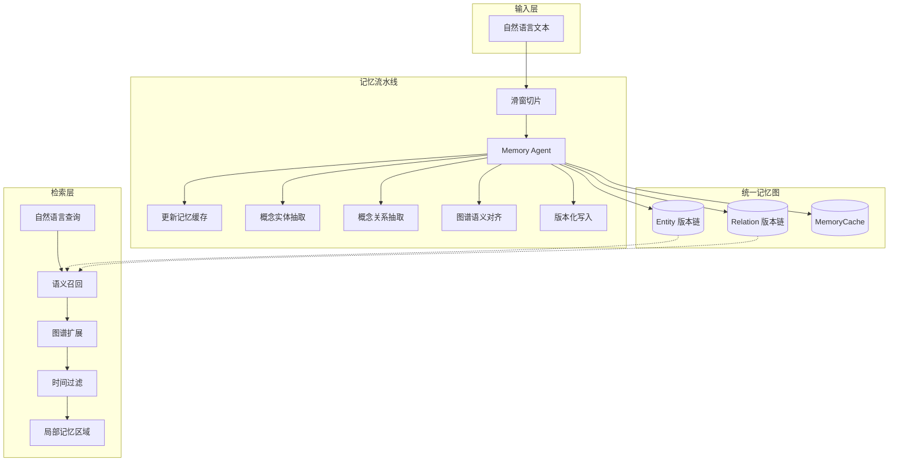

<p align="center">
  
  
  
  
</p>

<p align="center">
  <strong>Temporal Memory Graph (TMG)</strong>
</p>
<p align="center">
  <b>为 Agent 设计的长期记忆系统</b> —— 像人类一样存、取、回溯。
</p>

<p align="center">
  <a href="README.md">中文</a> · <a href="README.en.md">English</a> · <a href="README.ja.md">日本語</a>
</p>

---

## 简介

TMG 让 AI Agent 拥有**带时间的自然语言记忆**：专门为 Agent 提供**长期存取记忆**能力，**像人类一样**用自然语言记忆与回忆，并**将时间作为一等公民**——每条记忆可追溯，实体与关系带版本链。经历被写入一张统一知识图，用自然语言提问即可唤醒相关片段，并支持「那时发生了什么」式的时间回溯。

| 定位 | 说明 |
|------|------|
| **面向 Agent** | 为智能体提供长期记忆存储与检索，而非面向人类的笔记或知识库。 |
| **像人类一样** | 以自然语言写入与查询，不依赖预定义标签；由系统完成概念抽取与关系构建。 |
| **时间是一等公民** | 记忆带时间戳，实体/关系具备版本链，支持按时间范围或时间点回溯。 |
| **统一记忆图** | 所有记忆写入同一张图，通过语义检索与图谱扩展召回「一片相关记忆」。 |

系统职责边界：仅提供 **Remember**（写入）与 **Find**（检索）；**Select**（筛选与决策）由调用方完成。

### 与传统知识图谱的对比

| 维度 | 传统知识图谱 | TMG |
|------|--------------|-----|
| 关系表示 | 固定关系类型（如 is_a, located_in） | 自然语言描述（概念边） |
| 写入方式 | 需结构化输入与 schema | 直接输入文本/文档，系统自动抽取与对齐 |
| 时间模型 | 多为静态或简单时间戳 | 版本链 + 时间戳，支持按时间回溯 |
| 更新策略 | 多为覆盖更新 | 追加式更新，保留完整历史 |
| 检索方式 | 结构化查询、标签过滤 | 语义检索 + 图谱邻域扩展 |

---

## 系统架构



---

## 快速开始

```bash
cp service_config.example.json service_config.json
# 编辑 service_config.json：配置 LLM 与 embedding
python service_api.py --config service_config.json
```

**写入记忆（默认异步，立即返回 task_id）：**

```bash
curl -s -X POST http://localhost:16200/api/remember \
  -H "Content-Type: application/json" \
  -d '{"text": "林嘿嘿是考古学博士，在山洞遇见了会说话的白狐。白狐说已守护山洞三百年。", "event_time": "2026-03-09T14:00:00"}' | jq
# → {"success": true, "data": {"task_id": "abc123", "status": "queued", ...}}

# 查询状态
curl -s http://localhost:16200/api/remember/status/abc123 | jq
```

**检索记忆：**

```bash
curl -s -X POST http://localhost:16200/api/find \
  -H "Content-Type: application/json" \
  -d '{"query": "林嘿嘿和白狐之间发生了什么"}' | jq
```

---

## 使用 Skill（Agent 集成）

TMG 提供 **Skill**，使 Cursor、Claude 等 Agent 能够按文档完成部署、配置、启动及 API 调用，无需手写 HTTP 客户端。

### Skill 位置与内容

- **路径**：`Temporal_Memory_Graph/skills/tmg-memory-graph/`
- **文件**：`SKILL.md`（Agent 行为说明）、`reference.md`（接口速查）
- **作用**：支持「按文档执行」的 Agent 在阅读 SKILL 后即可完成何时调用 TMG、如何部署、如何调用 API。

### 三步让 Agent 使用 TMG

1. **暴露 Skill 给 Agent**  
   - **Cursor**：在规则中注明「使用 TMG 记忆时，请阅读并遵循 `Temporal_Memory_Graph/skills/tmg-memory-graph/SKILL.md`」，或将要点写入 `.cursor/rules`。  
   - **Claude / 其他**：将 `skills/tmg-memory-graph/` 加入该 Agent 的技能目录或知识库。

2. **通过自然语言触发**  
   当用户表达「把这件事记下来」「查一下之前关于某某的记忆」「对接 TMG 记忆服务」时，Agent 会读取 SKILL 并执行相应流程（检查服务状态 → 执行 remember/find）。

3. **Agent 将执行的操作**  
   - 若服务未就绪：克隆仓库 → 配置 `service_config.json` → 启动 `python service_api.py` → 使用 `GET /health` 确认。  
   - 写入：`POST /api/remember`，JSON body 传入 `text`（仅支持文本），可选 `event_time` 指定事件实际发生时间。默认异步返回 `task_id`，通过 `/api/remember/status/<task_id>` 轮询进度。  
   - 检索：`POST /api/find` 传入自然语言 `query`；需要时可使用实体/关系/版本/子图等原子接口。  
   - 集成到 Agent 身份：在 SOUL.md 中声明记忆能力，在 HEARTBEAT.md 中加入定期记忆同步，在 AGENTS.md 中配置会话启动/结束的记忆流程。详见 `SKILL.md` 中的集成指南。

---

## API 概览

### Remember — 记忆写入（默认异步）

仅接受 JSON body，`text` 为必填。建议批量、整段传入，避免一两句一调。

| 字段 | 必填 | 说明 |
|------|------|------|
| `text` | 是 | 自然语言文本 |
| `source_name` | 否 | 来源名称 |
| `event_time` | 否 | ISO 8601，事件实际发生时间（不传则用处理时间） |
| `load_cache_memory` | 否 | 是否接着上一段记忆链写 |
| `async` | 否 | 默认 `true`——异步返回 `task_id`（HTTP 202）；`false` 同步等待 |

**异步模式**（默认）：请求立即返回 `task_id`，后台流水线并行处理。可通过 `GET /api/remember/status/<task_id>` 查询进度，`GET /api/remember/queue` 查看队列。

**两阶段线程模型**：每个 text 先生成「文档整体记忆」再跑滑窗链；A 的整体记忆生成后即可启动 B（B 以 A 的整体记忆为初始），无需等 A 最后一窗。并行度由配置 **`remember_workers`** 控制（同时进行 phase1 的线程数；phase2 串行以保证 cache 链一致）。

**时间轴约定**：存入记忆库的「真实时间」以请求中的 `event_time` 为准；实体/关系的版本顺序也按该时间。因此即使后发的请求先完成（例如并发时短任务 B 先完成、长任务 A 后完成），时间轴仍按 `event_time` 正确——A 的 event_time 早则 A 的版本在前，与任务完成先后无关。

服务端自动保存原文到 `storage_path/originals/`，返回 `original_path`。内部完成切片、记忆缓存更新、实体/关系抽取、图谱对齐与版本化写入。

### Find — 语义检索

- **推荐**：`POST /api/find`，单请求完成语义召回、图谱扩展与时间过滤；必填参数为 `query`，其余可选。  
- **原子接口**：实体检索（`/api/find/entities/search` 等）、关系检索、记忆缓存、子图创建/扩展/过滤、统计（`/api/find/stats`）等。  

完整路径与参数见 `skills/tmg-memory-graph/reference.md` 及 `service_api.py`。

### 响应格式

- 成功：`{"success": true, "data": ..., "elapsed_ms": 123.45}`
- 失败：`{"success": false, "error": "错误信息", "elapsed_ms": 12.34}`

---

## 数据模型简述

- **Entity**：概念实体；含 `entity_id`（逻辑 ID）、`id`（版本绝对 ID）、`name`、`content`（自然语言）、`physical_time`；多版本形成版本链。  
- **Relation**：概念关系；以自然语言描述（非固定关系类型），含 `entity1/2_absolute_id`、`physical_time` 及版本链。  
- **MemoryCache**：系统内部上下文摘要链，用于对齐与推理。  

全量内容为自然语言 + 时间；无预定义标签体系。

---

## 配置

参考 `service_config.example.json` 配置 `service_config.json`：

- **服务**：`host`、`port`、`storage_path`  
- **LLM**：`api_key`、`model`、`base_url`、`think`  
- **Embedding**：`embedding.model`（本地路径或 HuggingFace 模型名）、`embedding.device`  
- **分块**：`chunking.window_size`、`chunking.overlap`  
- **子图**：`subgraph_max_count`、`subgraph_ttl_seconds`  
- **Remember 队列**：`remember_workers`、`remember_max_retries`、`remember_retry_delay_seconds`  
- **总线程数上限**：`max_total_worker_threads`（可选）。设后会对三层线程做统一封顶，避免线程爆炸；超出时按**优先级从低到高**缩小：先缩 `pipeline.llm_threads`，再缩 `pipeline.max_concurrent_windows`，最后缩 `remember_workers`。

**三层线程（优先级从高到低）**  
1. **remember_workers** — 队列 worker 数（最高优先级，保证接活能力）  
2. **pipeline.max_concurrent_windows** — 单任务内并行滑窗数  
3. **pipeline.llm_threads** — 单窗口内实体/关系并行数（最低优先级）  
峰值估算：`remember_workers + max_concurrent_windows + max_concurrent_windows * llm_threads`。

**使用智谱 GLM（OpenAI 兼容）**：将 `llm` 设为 `"api_key": "你的智谱 API Key"`、`"model": "glm-4.7-flash"`、`"base_url": "https://open.bigmodel.cn/api/coding/paas/v4"` 即可，服务会自动走 OpenAI 兼容的 `/chat/completions` 接口。

**使用 LM Studio（OpenAI 兼容）**：在 LM Studio 中加载模型并启动「Local Server」后，将 `llm` 设为 `"api_key": "lmstudio"`（或任意非空字符串）、`"model": "模型 ID"`（与 LM Studio 中显示的模型名完全一致，如 `qwen3.5-4b`）、`"base_url": "http://127.0.0.1:1234/v1"`。LM Studio 默认端口为 **1234**，若你改过端口则用对应端口。

---

## License

见仓库根目录 [LICENSE](LICENSE) 文件（如有）。
