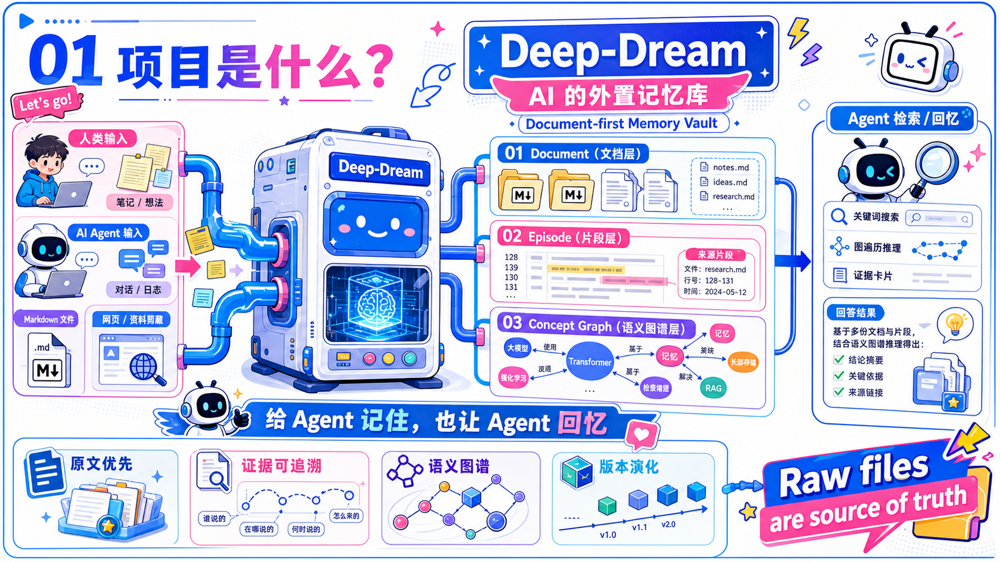
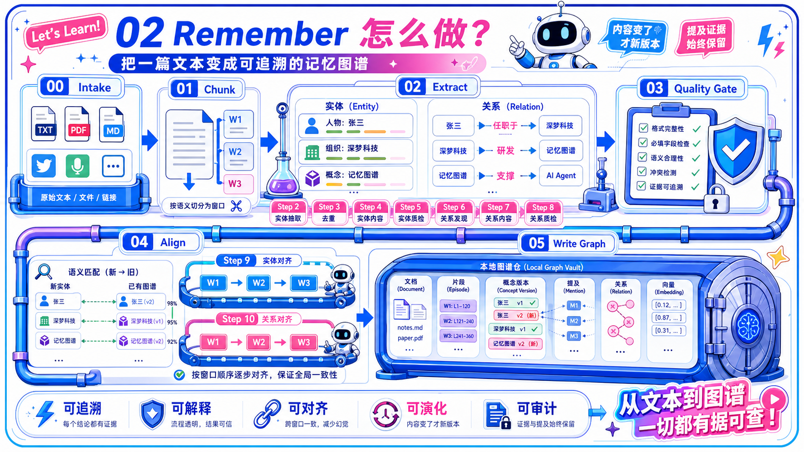
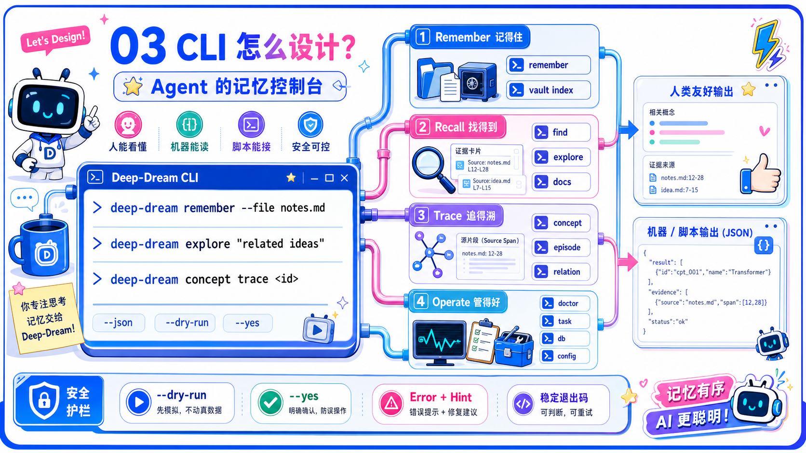

# Deep-Dream


Deep-Dream is a local, document-first memory vault for humans and AI agents.

It borrows the file-first vault idea from Markdown knowledge tools, but does
not depend on Obsidian or any closed-source app. Raw Markdown/text files remain
the source of truth; episodes, concepts, relations, embeddings, and graph views
are semantic overlays that help agents search, align, and verify evidence.

## Project Overview

Deep-Dream turns local notes and documents into a memory system that humans can
inspect and AI agents can recall. The original files stay readable and
editable, while the system builds traceable episodes, concepts, relations, and
graph views around them.



## Remember Pipeline

The `remember` flow converts raw text into structured, evidence-backed memory.
It chunks the input, extracts entities and relations, runs quality gates, aligns
new knowledge with existing concepts, and writes the result back to the local
graph with source evidence preserved.



## CLI Design

The CLI is designed as the control panel for both people and agents: task-first
commands, safe defaults, readable Rich output for humans, JSON output for
automation, and clear `Error + Hint` feedback when something goes wrong.



## Current Model

```text
Document -> Episode -> Concept
```

- `document`: a Markdown source document or remembered text source.
- `episode`: a heading-first source span/chunk inside a document.
- `entity`: an extracted entity concept.
- `relation`: an extracted relation concept.

Relations are concepts too. A relation version uses `CONNECTS` edges to point to endpoint entity concepts and `ASSERTS` edges to trace the episode that asserted it.

Each episode mention creates a new concept version across episodes. Within the same episode, the same concept family is written once.

## Storage Layout

Deep-Dream uses one local library.

```text
{storage_root}/
  graph.db
  documents/
    managed/
    external/
  snapshots/
  artifacts/
  indexes/
  logs/
  tasks/
  library.json
```

The default `storage_path` is `./library`. Legacy data in `./graphs/*` can be
migrated with:

```bash
python -m core.cli library migrate --config service_config.json
```

## API

Base URL: `http://localhost:16200/api/v1`

Document-first endpoints:

- `POST /vaults/index`
- `GET /vaults/tree`
- `GET /documents`
- `GET /documents/map?path=...`
- `GET /documents/search?q=...`
- `GET /documents/<document_version_id>/content`
- `POST /remember`
- `GET /concepts`
- `GET /concepts/<family_id>`
- `GET /concepts/<family_id>/versions`
- `GET /concepts/<family_id>/provenance`
- `POST /concepts/search`
- `POST /traverse`

Agent workflow:

```text
1. Search and read raw files first.
2. Map files to document ids when graph context is needed.
3. Use episodes for source spans and line evidence.
4. Use concepts/relations for semantic expansion and alignment.
5. Verify final claims against raw text or episode source_text.
```

See `docs/deep-dream-vault-plan.md` for the current architecture direction.

## Development

Frontend detail UI rules:

- Entity/relation detail, version history, and diff UI must use `core/server/static/js/shared/concept-detail.js`.
- See `docs/frontend-concept-detail-guidelines.md` before changing graph/search detail interactions.

Remember performance rules:

- See `docs/remember-performance-profiling.md` before changing remember timing or speed paths.
- Keep the tested 10-step extraction/alignment semantics stable; optimize batching, caching, scheduling, indexing, and transactions first.

Run focused storage tests:

```bash
python -m pytest core/tests/test_concept_store_v1.py
```

Run the API server:

```bash
python -m core.server.api --config service_config.json --skip-llm-check
```
