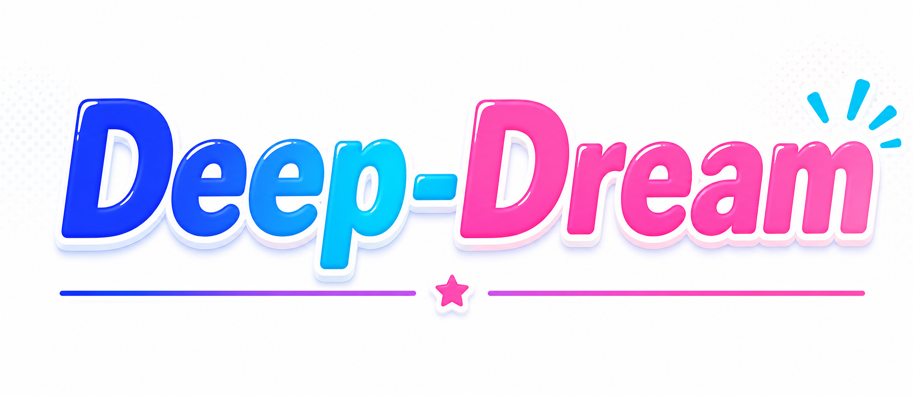

<div align="center">



# Deep-Dream

**Document-first concept graph memory server**

[](https://www.python.org/downloads/)
[](LICENSE)
[](pyproject.toml)

Turns local documents into a structured memory system that humans can inspect and AI agents can recall. Raw files stay readable and editable; the system builds traceable documents, episodes, concepts, relations, and graph views on top.

English · [简体中文](README.md)

</div>

---

## Features

- **Document-first** — Markdown / plain text files are always the source of truth; the concept graph is a semantic overlay
- **Remember Pipeline** — Multi-step extraction: chunking → entity extraction → relation discovery → alignment merging → dedup + write
- **Hybrid Search** — BM25 full-text + vector embeddings + graph BFS expansion, fused via Reciprocal Rank Fusion (RRF)
- **CLI Console** — Click 8+ / Rich 13+, 19 commands, human-readable Rich output + `--json` machine mode
- **Web UI** — Dashboard, memory upload, interactive graph, semantic search, community detection, settings
- **Concept Versioning** — Each concept maintains a `family_id` (stable identity) and version chain (evolution over episodes)
- **Vault Indexing** — Obsidian / Markdown vault support with Wikilink extraction and heading parsing
- **Multilingual UI** — 中文 / English / 日本語, dark / light theme
- **Local-first** — SQLite + local embedding models, supports Ollama and any OpenAI-compatible endpoint
- **Async Task Queue** — Pause / resume / retry with disk persistence and crash recovery

## Remember Pipeline

The `remember` flow converts raw text into structured, evidence-backed memory: chunk input → extract entities and relations → quality gates → align with existing concepts → write to local graph, with source evidence preserved throughout.

**Pipeline steps (strong-v1 single-pass extraction):**

1. **Document Chunking** — Markdown heading-aware smart chunking with overlap windows (strong-v1 defaults to large 6000/300 windows)
2. **Episode Generation** — Each chunk becomes an Episode (memory event)
3. **Single-pass Extraction** — One LLM call per window produces entities, entity content, and relations together, preserving evidence text and line numbers
4. **Concept Alignment** — In-window batch alignment + matching against existing concepts (conservative policy)
5. **Cross-window Merge** — Same-name concepts across episodes in a document are merged via the unified content merger
6. **Write to Storage** — FamilyWriteGate family-level write gating, written to SQLite with embeddings updated

## Quick Start

### Install

```bash
# Clone the repo
git clone <repo-url>
cd deep-dream

# Base install (remote embeddings or text-only search)
pip install -e .

# Install this extra for the local HuggingFace embedding in the example
pip install -e '.[local-embeddings]'
```

### Configure

```bash
# Create your config from the example
cp service_config.example.json service_config.json
```

Edit `service_config.json` with your LLM endpoint:

```json
{
  "llm": {
    "api_key": "your-api-key",
    "model": "your-model-name",
    "base_url": "http://127.0.0.1:11434",
    "max_tokens": 3000,
    "context_window_tokens": 8000
  },
  "embedding": {
    "model": "Qwen/Qwen3-Embedding-0.6B",
    "device": "cpu"
  }
}
```

Supports any OpenAI-compatible endpoint (Ollama, LM Studio, GLM, Xinference, etc.).

### Run

```bash
# Start via CLI
deep-dream --config service_config.json server start

# Or run directly
python -m core.server.api --config service_config.json

# Windows one-click
start.bat
```

The server runs at `http://localhost:16200` by default.

Keep `host: "127.0.0.1"` for local-only use. For a LAN listener, enable
`auth.enabled` and `auth.strict_mode`, then provide an API-key file through
`DEEPDREAM_API_KEYS_FILE` (or `auth.api_keys_file`). The key button in the UI
stores that API key for browser requests. The file format is:

```json
{
  "desktop": {
    "key": "replace-with-a-long-random-secret",
    "permissions": ["read", "find:read", "remember:write", "concepts:read", "documents:read"]
  }
}
```

The example above is a least-privilege key. For configuration, document/Vault
writes, or graph clearing, use a separate administrative key with
`"permissions": ["admin"]`; do not give that permission to ordinary browser users.

## CLI

The CLI is the control panel for both humans and agents: task-first command structure, safe defaults, Rich-formatted output, and `--json` automation mode.

**19 commands:**

| Command | Description |
|---------|-------------|
| `deep-dream version` | Print version |
| `deep-dream doctor` | System health check |
| `deep-dream config` | View / edit configuration |
| `deep-dream remember` | Write text / files into memory graph |
| `deep-dream ingest <path>` | Direct file ingestion (`--profile log` = zero-LLM fast path) |
| `deep-dream find <query>` | Semantic concept search |
| `deep-dream explore` | Concept semantic exploration |
| `deep-dream concept` | Concept CRUD |
| `deep-dream episode` | Episode inspection |
| `deep-dream relation` | Relation inspection |
| `deep-dream docs` | Document management |
| `deep-dream graph` | Graph management |
| `deep-dream vault` | Obsidian / Markdown vault indexing |
| `deep-dream server` | Start / manage the API server |
| `deep-dream task` | Task queue management |
| `deep-dream db` | Database maintenance |
| `deep-dream sql` | Direct SQL queries |
| `deep-dream scope <query>` | Graph-bounded document scope (`--materialize` for sandbox dir) |
| `deep-dream completion` | Shell completion setup |

**Global options:** `--json` · `--no-color` · `-q` · `--config`

### Evaluation & paper work

The evaluation harness (LoCoMo / LongMemEval / MemoryAgentBench, etc.) and the paper engineering live in `research/` and are not part of the system itself. See [research/README.md](research/README.md) for usage.

## Benchmark Results

Full-pipeline scores with a single model (Kimi-k3) serving as memory builder, question answerer, and (for judged domains) evaluator (2026-08, v2 engine):

| Benchmark | Track / protocol | Score |
|---|---|---:|
| **LongMemEval-S** (full 1176 docs / 25 scopes) | pi (agentic retrieval) | **0.926** (v1 0.889) |
| **MemoryAgentBench** (sampled 767 Qs / 10 scopes, official scorer) | pi | **0.6511** (TTL 0.46 / FC-MH 0.70) |
| **BigCodeBench** (instruct/full, calibrated) | completion pass@1 | 0.4859 |
| **ALFWorld** (max 50 steps) | in-dist / out-of-dist | 0.9786 / 0.9851 |

- **v1→v2 paired experiments**: the v2 memory engine (cluster convergence + window-batch alignment) wins on all five LME dimensions (accuracy +0.04, recall@10 +8pp, calls/doc −65%); on MAB it lifts both target domains (TTL MCC 0.43→0.46, FC-MH 0.67→0.70) while cutting calls/doc by 46%.
- **Landscape**: MAB Overall leads every published system in the official paper's Table 2 (~+10pp after sampling-scope adjustment); on the judge-free FC-MH task it scores 70 vs a field best of 7 (deterministic SubEM). LME 0.926 sits in the top tier of the public ecosystem.
- **Caveats**: scores come from our own evaluation pipeline; judged domains use kimi-k3 as both actor and judge (official baselines mostly use GPT-4o judging); the MAB run is a sampled subset (767 of 3671 questions). Full methodology disclosures live in the reports.
- Complete data, paired comparisons, and the external-system landscape table: [`research/reports/`](research/reports/).

## Web UI

Deep-Dream ships with a full-featured single-page application:

- **Dashboard** — System overview, task progress, live logs, statistics
- **Memory** — Text / file upload, task monitoring, document browsing
- **Graph Visualization** — Interactive vis-network graph with growth animation, document subgraphs, timeline playback, role-colored nodes (document=purple, episode=blue, entity=teal, relation=amber)
- **Semantic Search** — Three modes (normal / multi-query / traverse), path finder, threshold & time filters, search history
- **Graph analysis** — Document subgraphs, neighbor traversal, and timeline views
- **API Test** — Raw API request testing interface
- **Settings** — Live configuration editor

## Data Model

```text
Document → Episode → Concept (entity / relation / observation)
```

- **Document** — Markdown source or remembered text (managed / external / vault modes)
- **Episode** — A heading-level source span within a document; the basic unit of memory extraction
- **Entity** — Extracted entity concept with a version chain; each episode mention creates a new version
- **Relation** — Extracted relation concept connecting two entities, with evidence text and line offsets

**Unified Concept Model:** Entities, relations, and observations are all different roles of a `Concept`, sharing a `family_id` (stable identity) and version chain (evolution history).

**Schema V1.5 (12 tables):**

| Table | Description |
|-------|-------------|
| `documents` | Source documents |
| `document_versions` | Document version snapshots |
| `episodes` | Source text chunks |
| `entity_families` | Entity identity (across versions) |
| `entity_observations` | Per-episode entity observations |
| `entity_mentions` | Text mentions with offsets |
| `relation_families` | Relation identity |
| `relation_assertions` | Per-episode relation assertions |
| `embeddings` | General-purpose embedding storage |
| `pipeline_runs` | Pipeline execution tracking |
| `document_links` | Wikilink / Markdown links |
| `entity_redirects` | Entity merge redirects |

Plus `episodes_fts` (FTS5 with trigram tokenizer for CJK) and `graph_edges` view.

## API

Base URL: `http://localhost:16200/api/v1`

**Key endpoints:**

| Category | Endpoint | Description |
|----------|----------|-------------|
| Memory | `POST /remember` | Submit text / file for memory ingestion |
| | `POST /ingest` | Unified ingestion (prose pipeline / zero-LLM log) |
| | `GET /remember/tasks` | Task queue list |
| Search | `POST /concepts/search` | Semantic concept search |
| | `POST /scope` | Graph-bounded document scope (optional sandbox) |
| | `POST /traverse` | Graph traversal |
| Concepts | `GET /concepts` | List concepts |
| | `GET /concepts/<family_id>` | Concept detail |
| | `GET /concepts/<family_id>/versions` | Version history |
| | `GET /concepts/<family_id>/provenance` | Provenance trace |
| Documents | `GET /documents` | Document list |
| | `GET /documents/<id>/content` | Document content |
| | `GET /documents/search` | Search raw files |
| Vault | `POST /vaults/index` | Index Markdown / Obsidian vault |
| | `GET /vaults/tree` | Vault file tree |
| System | `GET /health` | Health check |
| | `GET /stats/counts` | Concept statistics |

**Agent workflow:**

```text
1. Search and read raw files first
2. Map files to document IDs when graph context is needed
3. Use episodes for source spans and line-level evidence
4. Use concepts/relations for semantic expansion and alignment
5. Verify final claims against raw text or episode source_text
```

**Agent Harness (pi):** `harness/pi/` turns [pi](https://github.com/earendil-works/pi)
(MIT) into a Deep-Dream-native harness — an extension registers the `dd_scope` /
`dd_search` / `dd_ingest` memory tools and the graph-bounded sandbox workflow
(graph bounds scope → bash reads). See [harness/pi/README.md](harness/pi/README.md).

## Storage Layout

```text
library/                     # Default storage path
  library.db                 # SQLite main database
  documents/
    managed/                 # System-managed documents
    external/                # Externally referenced documents
  snapshots/                 # Document snapshots
  artifacts/                 # Attachments
  indexes/                   # Indexes
  logs/                      # Logs
  tasks/                     # Task persistence
  library.json               # Library metadata
```

## Configuration

Configuration lives in `service_config.json`. Key options:

```json
{
  "host": "127.0.0.1",
  "port": 16200,
  "storage_path": "./library",
  "storage": { "backend": "sqlite", "vector_dim": 1024 },
  "llm": {
    "model": "model_name",
    "base_url": "http://127.0.0.1:11434",
    "max_concurrency": 3,
    "alignment": {
      "model": "alignment_model_name",
      "base_url": "http://127.0.0.1:11435"
    }
  },
  "embedding": {
    "model": "Qwen/Qwen3-Embedding-0.6B",
    "device": "cpu"
  },
  "chunking": { "window_size": 1000, "overlap": 200 },
  "pipeline": {
    "remember": { "profile": "strong-v1", "alignment_policy": "conservative" }
  }
}
```

**Dual LLM protocol:** Supports both Ollama native (`/api/chat`) and OpenAI-compatible (`/v1/chat/completions`) protocols.

**Embedding:** Defaults to local sentence-transformers models with LRU cache + SHA-256 keys + TTL auto-expiry.

## Development

```bash
# Install dev dependencies
pip install -e ".[dev]"

# Run tests
python -m pytest core/tests/

# Start server (skip LLM check)
python -m core.server.api --config service_config.json --skip-llm-check

# Lint
ruff check core/
```

## Tech Stack

- **Backend:** Python / Flask / SQLite (FTS5)
- **CLI:** Click 8+ / Rich 13+
- **LLM:** OpenAI SDK (compatible with Ollama, LM Studio, GLM, etc.)
- **Embedding:** sentence-transformers (local models)
- **Frontend:** Vanilla SPA (vis-network, Tailwind CSS, Lucide Icons)
- **Search:** BM25 + vector retrieval + graph traversal, RRF fusion

## License

[MIT](LICENSE)
